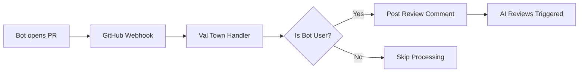

# PR Bot Reviewer

An automated GitHub webhook handler that triggers AI code reviews when bots open pull requests. Built for Val Town deployment.

## Overview

The PR Bot Reviewer automatically detects when a bot opens a pull request and posts a standardized comment to trigger multiple AI code review services. This ensures consistent code quality checks for automated PRs without manual intervention.

## Features

- 🤖 **Smart Bot Detection**: Identifies bot users by GitHub type or login pattern
- 🔄 **Multi-Service Reviews**: Triggers 4 different AI review services simultaneously
- 🛡️ **Robust Error Handling**: Comprehensive error handling with detailed logging
- 🚀 **Val Town Ready**: Optimized for serverless deployment on Val Town
- 📝 **TypeScript**: Fully typed with comprehensive interfaces

## Quick Start

### 1. Environment Setup

Set the required environment variable in your Val Town project:

```bash
GITHUB_TOKEN=your_github_personal_access_token_here
```

**GitHub Token Requirements:**
- Must be a Personal Access Token (PAT)
- Requires `repo` scope for posting comments on pull requests
- Should have access to the repositories where you want to enable bot PR reviews

### 2. Deploy to Val Town

1. Create a new HTTP Val in Val Town
2. Copy the contents of `webhook-handler.http.ts` into your Val
3. Set the `GITHUB_TOKEN` environment variable
4. Save and deploy your Val

### 3. Configure GitHub Webhook

1. Go to your repository settings → Webhooks
2. Click "Add webhook"
3. Set the Payload URL to your Val Town endpoint: `https://[username]-[valname].web.val.run`
4. Set Content type to `application/json`
5. Select "Let me select individual events" and choose:
   - ✅ Pull requests
6. Ensure the webhook is Active
7. Click "Add webhook"

## How It Works



### Bot Detection Logic

The system identifies bot users using two criteria:
- **Type-based**: Users with `type: "Bot"` in GitHub API
- **Login-based**: Users with login ending in `[bot]` (e.g., `dependabot[bot]`)

### Review Services Triggered

When a bot PR is detected, the following review triggers are posted:
```
@coderabbitai review
/gemini review
@cubic-dev-ai review
@greptile review
```

## Configuration

### Required Environment Variables

| Variable | Description | Required | Example |
|----------|-------------|----------|---------|
| `GITHUB_TOKEN` | GitHub Personal Access Token with `repo` scope | ✅ | `ghp_xxxxxxxxxxxx` |

### Creating a GitHub Personal Access Token

1. Go to GitHub Settings → Developer settings → Personal access tokens → Tokens (classic)
2. Click "Generate new token (classic)"
3. Set expiration and select scopes:
   - ✅ `repo` (Full control of private repositories)
4. Click "Generate token"
5. Copy the token immediately (you won't see it again)

## API Reference

### Webhook Payload

The handler expects GitHub webhook payloads with the following structure:

```typescript
interface WebhookPayload {
  action: string;           // Must be "opened"
  number: number;          // PR number
  pull_request: {
    user: {
      login: string;       // GitHub username
      type: string;        // User type ("Bot" or "User")
      id: number;         // User ID
    };
  };
  repository: {
    full_name: string;     // Repository name (owner/repo)
  };
}
```

### Response Formats

**Success Response (200):**
```json
{
  "success": true,
  "message": "Review comment posted successfully for bot PR #123 by dependabot[bot]",
  "timestamp": "2024-01-01T12:00:00.000Z"
}
```

**Error Response (4xx/5xx):**
```json
{
  "error": "ERROR_CODE",
  "message": "Human readable error message",
  "timestamp": "2024-01-01T12:00:00.000Z"
}
```

## Error Handling

The system provides comprehensive error handling for various scenarios:

### Common Error Codes

| Code | Status | Description | Solution |
|------|--------|-------------|----------|
| `MISSING_GITHUB_TOKEN` | 500 | GitHub token not configured | Set `GITHUB_TOKEN` environment variable |
| `GITHUB_AUTH_FAILED` | 401 | Invalid GitHub token | Check token validity and permissions |
| `GITHUB_RATE_LIMIT` | 429 | API rate limit exceeded | Wait and retry, consider token limits |
| `INVALID_PAYLOAD_TYPE` | 400 | Malformed webhook payload | Check webhook configuration |
| `METHOD_NOT_ALLOWED` | 405 | Non-POST request received | Ensure webhook sends POST requests |

### Troubleshooting

**Webhook not triggering:**
1. Check webhook configuration in repository settings
2. Verify webhook URL points to your Val Town endpoint
3. Ensure webhook is set to send "Pull requests" events

**Authentication errors:**
1. Verify `GITHUB_TOKEN` is set correctly
2. Check token has `repo` scope
3. Ensure token hasn't expired

**Comments not posting:**
1. Check repository permissions for the token
2. Verify PR number and repository name in logs
3. Check GitHub API status

## Development

### Project Structure

```
├── webhook-handler.http.ts    # Main webhook handler (Val Town entry point)
├── README.md                  # This documentation
└── .kiro/specs/              # Feature specifications
    └── pr-bot-reviewer/
        ├── requirements.md    # Feature requirements
        ├── design.md         # Technical design
        └── tasks.md          # Implementation tasks
```

### Key Components

- **BotDetector**: Identifies bot users from GitHub data
- **GitHubApiClient**: Handles GitHub API authentication and requests
- **CommentService**: Generates and posts review comments
- **WebhookHandler**: Main request processing logic

### Testing

The project includes comprehensive test coverage:
- Unit tests for individual components
- Property-based tests for universal behaviors
- Integration tests for end-to-end workflows

## Val Town Deployment

### Requirements

- Val Town account with HTTP trigger support
- Environment variable configuration capability
- Internet access for GitHub API calls

### Deployment Steps

1. **Create New Val**: Create an HTTP trigger Val in Val Town
2. **Copy Code**: Paste the webhook handler code
3. **Set Environment**: Configure `GITHUB_TOKEN` in Val settings
4. **Test Endpoint**: Verify the Val responds to HTTP requests
5. **Configure Webhook**: Point GitHub webhook to your Val URL

### Val Town Specific Considerations

- Uses `Deno.env.get()` for environment variables
- Exports default function as HTTP handler entry point
- Includes proper error handling for serverless environment
- Optimized for Val Town's execution model

## Security

### Best Practices

- ✅ Never hardcode GitHub tokens in source code
- ✅ Use environment variables for sensitive configuration
- ✅ Validate all incoming webhook payloads
- ✅ Implement proper error handling to prevent information leakage
- ✅ Use HTTPS endpoints for webhook URLs

### Token Security

- Store tokens as environment variables only
- Use tokens with minimal required permissions (`repo` scope)
- Regularly rotate Personal Access Tokens
- Monitor token usage in GitHub settings

## Monitoring

### Logging

The system provides detailed logging for troubleshooting:

```typescript
// Example log output
{
  "error": "GitHub API authentication failed",
  "timestamp": "2024-01-01T12:00:00.000Z",
  "url": "https://api.github.com/repos/owner/repo/issues/123/comments",
  "status": 401
}
```

### Health Checks

Monitor these indicators for system health:
- Webhook delivery success rate in GitHub settings
- Error rates in Val Town logs
- GitHub API rate limit usage
- Response time metrics

## Contributing

1. Fork the repository
2. Create a feature branch
3. Make your changes
4. Add tests for new functionality
5. Submit a pull request

## License

This project is open source and available under the MIT License.

## Support

For issues and questions:
1. Check the troubleshooting section above
2. Review Val Town documentation for deployment issues
3. Check GitHub webhook documentation for configuration help
4. Open an issue in the repository for bugs or feature requests